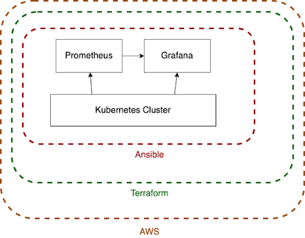
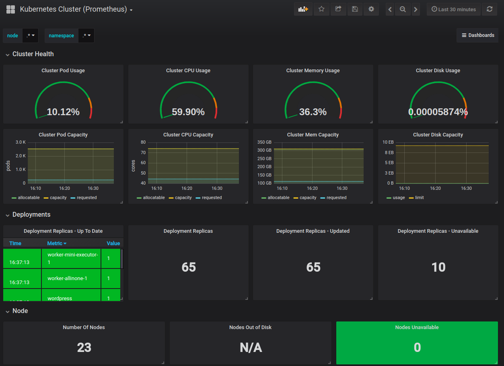

# Mini Challenge 1

Deploy [Kubernetes](https://kubernetes.io/docs/concepts/overview/what-is-kubernetes/) on [AWS](https://docs.aws.amazon.com/) manually using [Terraform](https://www.terraform.io/docs/index.html) and [Ansible](https://docs.ansible.com/ansible/latest/index.html) for more control over Kubernetes clusters in the cloud. A monitoring solution comprised of [Prometheus](https://prometheus.io/docs/prometheus/latest/getting_started/) and [Grafana](https://grafana.com/docs/) gives more oversight of the deployment.

## Introduction

Deploying Kubernetes the 'hard way' using Terraform and Ansible allows the developer to exercise more control over their cluster(s).

Terraform allow us to describe the target infrastructure; then it takes care of creating, modifying, or destroying any required resource(s) to match our blueprint.

Ansible is an IT automation tool. It can configure systems, deploy software, and orchestrate more advanced IT tasks such as continuous deployments or zero downtime rolling updates.

Together, these tools allowed us to provision and deploy a manual Kubernetes cluster giving a developer more control over their systems. A monitoring solution and dashboard further enhance this control by giving the developer more oversight of the cluster.

## System Diagram

    
    
System Diagram

## Demo

    
    
Grafana

## Setup

The comprehensive set of setup instructions can be found in [`setup.md`](setup.md)

## Contributors

-   [Adam Alston](https://github.com/adamalston)
